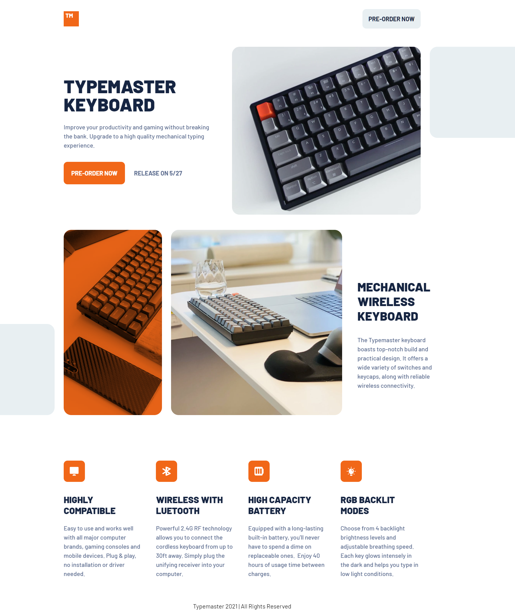

# Frontend Mentor - Typemaster pre-launch landing page solution

This is a solution to the [Typemaster pre-launch landing page challenge on Frontend Mentor](https://www.frontendmentor.io/challenges/typemaster-prelaunch-landing-page-J6-Yj5J-X).

## Overview

### The challenge

Users should be able to:

- View the optimal layout depending on their device's screen size
- See hover states for interactive elements

### Screenshot

### Links

- Solution URL: [My solution](https://github.com/ahmedattlam10/Typemaster-pre-launch-landing-page)
- Live Site URL: [Live site](https://ahmedattlam10.github.io/Typemaster-pre-launch-landing-page/)

### Built with

- Semantic HTML5 markup
- CSS custom properties
- Flexbox
- CSS Grid
- Mobile-first workflow

## Author

- Website - [Github-Profile](https://github.com/ahmedattlam10)
- Frontend Mentor - [FM-Profile](https://www.frontendmentor.io/profile/ahmedattlam10)
